# Lược đồ Activity - Hệ thống WebTruyen

> Render bằng [PlantUML Online](https://www.plantuml.com/plantuml/uml/)

---

## 1. Mở khóa chương truyện trả phí

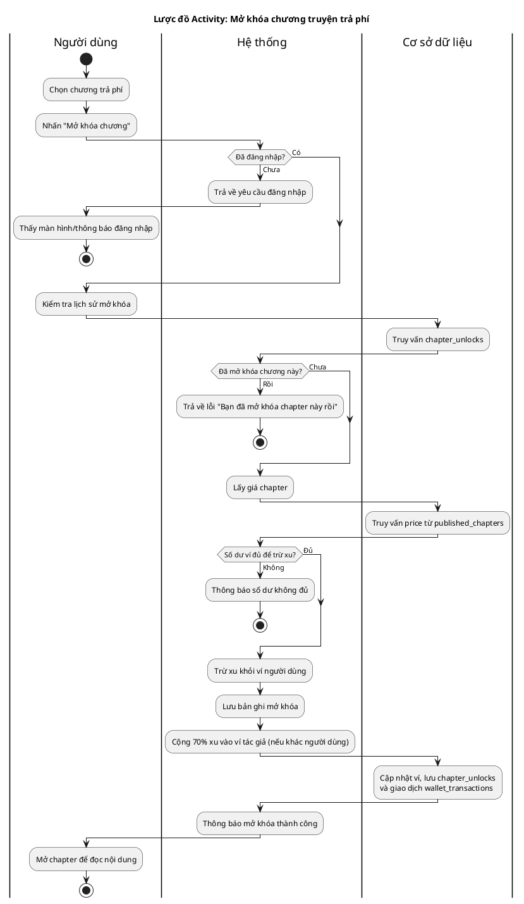
```plantuml
@startuml
title Lược đồ Activity: Mở khóa chương truyện trả phí

|Người dùng|
|Hệ thống|
|Cơ sở dữ liệu|

|Người dùng|
start
:Chọn chương trả phí;
:Nhấn "Mở khóa chương";

|Hệ thống|
if (Đã đăng nhập?) then (Chưa)
  :Trả về yêu cầu đăng nhập;
  |Người dùng|
  :Thấy màn hình/thông báo đăng nhập;
  stop
else (Có)
endif

:Kiểm tra lịch sử mở khóa;
|Cơ sở dữ liệu|
:Truy vấn chapter_unlocks;

|Hệ thống|
if (Đã mở khóa chương này?) then (Rồi)
  :Trả về lỗi "Bạn đã mở khóa chapter này rồi";
  stop
else (Chưa)
endif

:Lấy giá chapter;
|Cơ sở dữ liệu|
:Truy vấn price từ published_chapters;

|Hệ thống|
if (Số dư ví đủ để trừ xu?) then (Không)
  :Thông báo số dư không đủ;
  stop
else (Đủ)
endif

:Trừ xu khỏi ví người dùng;
:Lưu bản ghi mở khóa;
:Cộng 70% xu vào ví tác giả (nếu khác người dùng);
|Cơ sở dữ liệu|
:Cập nhật ví, lưu chapter_unlocks\nvà giao dịch wallet_transactions;

|Hệ thống|
:Thông báo mở khóa thành công;

|Người dùng|
:Mở chapter để đọc nội dung;

stop
@enduml
```

---

## 2a. Nạp xu vào ví qua VNPay

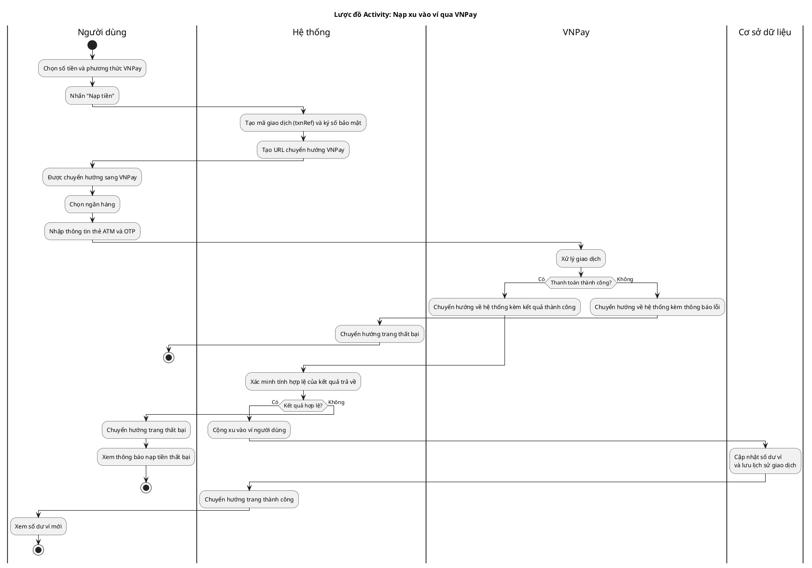
```plantuml
@startuml
title Lược đồ Activity: Nạp xu vào ví qua VNPay

|Người dùng|
|Hệ thống|
|VNPay|
|Cơ sở dữ liệu|

|Người dùng|
start
:Chọn số tiền và phương thức VNPay;
:Nhấn "Nạp tiền";

|Hệ thống|
:Tạo mã giao dịch (txnRef) và ký số bảo mật;
:Tạo URL chuyển hướng VNPay;

|Người dùng|
:Được chuyển hướng sang VNPay;

|Người dùng|
:Chọn ngân hàng;
:Nhập thông tin thẻ ATM và OTP;

|VNPay|
:Xử lý giao dịch;

if (Thanh toán thành công?) then (Có)
  :Chuyển hướng về hệ thống kèm kết quả thành công;
else (Không)
  :Chuyển hướng về hệ thống kèm thông báo lỗi;
  |Hệ thống|
  :Chuyển hướng trang thất bại;
  |Người dùng|
  stop
endif

|Hệ thống|
:Xác minh tính hợp lệ của kết quả trả về;

if (Kết quả hợp lệ?) then (Có)
  :Cộng xu vào ví người dùng;
  |Cơ sở dữ liệu|
  :Cập nhật số dư ví\nvà lưu lịch sử giao dịch;

  |Hệ thống|
  :Chuyển hướng trang thành công;

  |Người dùng|
  :Xem số dư ví mới;
  stop
else (Không)
  :Chuyển hướng trang thất bại;
  |Người dùng|
  :Xem thông báo nạp tiền thất bại;
  stop
endif
@enduml
```

---

## 2b. Nạp xu vào ví qua MoMo

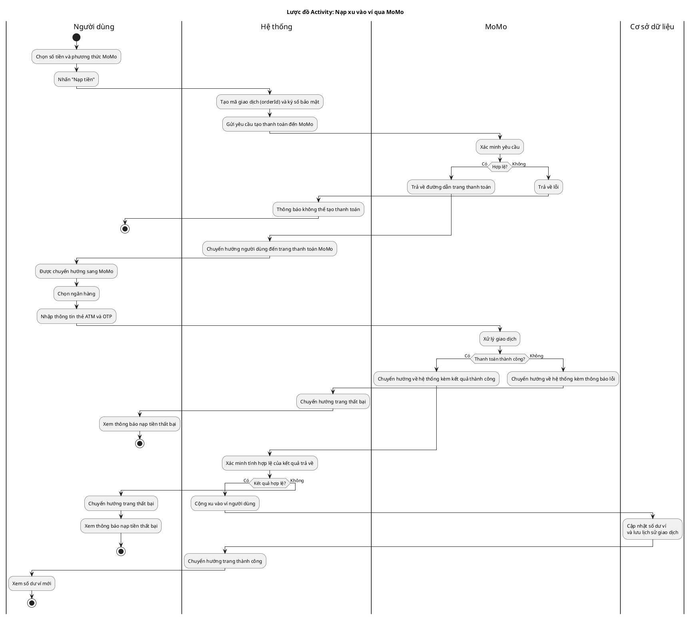
```plantuml
@startuml
title Lược đồ Activity: Nạp xu vào ví qua MoMo

|Người dùng|
|Hệ thống|
|MoMo|
|Cơ sở dữ liệu|

|Người dùng|
start
:Chọn số tiền và phương thức MoMo;
:Nhấn "Nạp tiền";

|Hệ thống|
:Tạo mã giao dịch (orderId) và ký số bảo mật;
:Gửi yêu cầu tạo thanh toán đến MoMo;

|MoMo|
:Xác minh yêu cầu;

if (Hợp lệ?) then (Có)
  :Trả về đường dẫn trang thanh toán;
else (Không)
  :Trả về lỗi;
  |Hệ thống|
  :Thông báo không thể tạo thanh toán;
  |Người dùng|
  stop
endif

|Hệ thống|
:Chuyển hướng người dùng đến trang thanh toán MoMo;

|Người dùng|
:Được chuyển hướng sang MoMo;
:Chọn ngân hàng;
:Nhập thông tin thẻ ATM và OTP;

|MoMo|
:Xử lý giao dịch;

if (Thanh toán thành công?) then (Có)
  :Chuyển hướng về hệ thống kèm kết quả thành công;
else (Không)
  :Chuyển hướng về hệ thống kèm thông báo lỗi;
  |Hệ thống|
  :Chuyển hướng trang thất bại;
  |Người dùng|
  :Xem thông báo nạp tiền thất bại;
  stop
endif

|Hệ thống|
:Xác minh tính hợp lệ của kết quả trả về;

if (Kết quả hợp lệ?) then (Có)
  :Cộng xu vào ví người dùng;
  |Cơ sở dữ liệu|
  :Cập nhật số dư ví\nvà lưu lịch sử giao dịch;

  |Hệ thống|
  :Chuyển hướng trang thành công;

  |Người dùng|
  :Xem số dư ví mới;
  stop
else (Không)
  :Chuyển hướng trang thất bại;
  |Người dùng|
  :Xem thông báo nạp tiền thất bại;
  stop
endif
@enduml
```

---

## 3. Điểm danh hàng ngày nhận xu

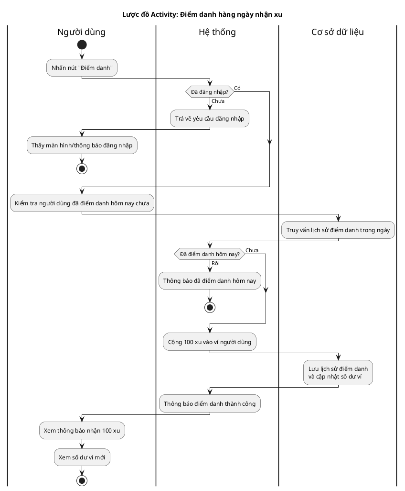
```plantuml
@startuml
title Lược đồ Activity: Điểm danh hàng ngày nhận xu

|Người dùng|
|Hệ thống|
|Cơ sở dữ liệu|

|Người dùng|
start
:Nhấn nút "Điểm danh";

|Hệ thống|
if (Đã đăng nhập?) then (Chưa)
  :Trả về yêu cầu đăng nhập;
  |Người dùng|
  :Thấy màn hình/thông báo đăng nhập;
  stop
else (Có)
endif

:Kiểm tra người dùng đã điểm danh hôm nay chưa;
|Cơ sở dữ liệu|
:Truy vấn lịch sử điểm danh trong ngày;

|Hệ thống|
if (Đã điểm danh hôm nay?) then (Rồi)
  :Thông báo đã điểm danh hôm nay;
  stop
else (Chưa)
endif

:Cộng 100 xu vào ví người dùng;
|Cơ sở dữ liệu|
:Lưu lịch sử điểm danh\nvà cập nhật số dư ví;

|Hệ thống|
:Thông báo điểm danh thành công;

|Người dùng|
:Xem thông báo nhận 100 xu;
:Xem số dư ví mới;

stop
@enduml
```

---

## 4. Tặng xu cho tác giả

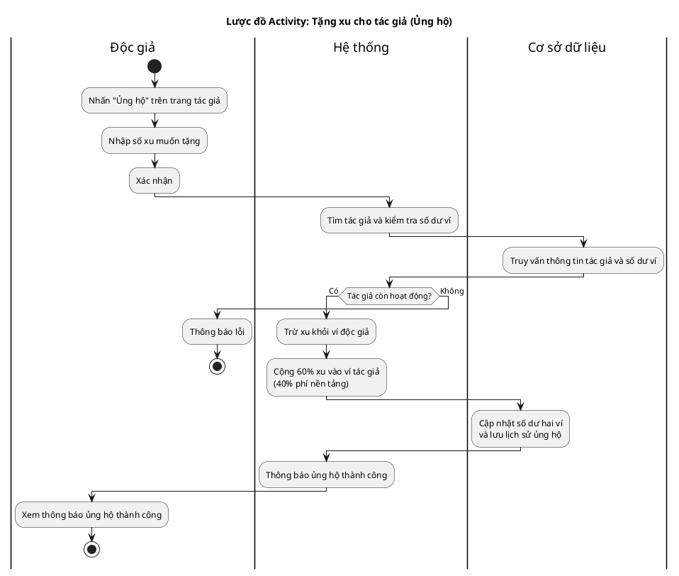
```plantuml
@startuml
title Lược đồ Activity: Tặng xu cho tác giả (Ủng hộ)

|Độc giả|
|Hệ thống|
|Cơ sở dữ liệu|

|Độc giả|
start
:Nhấn "Ủng hộ" trên trang tác giả;
:Nhập số xu muốn tặng;
:Xác nhận;

|Hệ thống|
:Tìm tác giả và kiểm tra số dư ví;
|Cơ sở dữ liệu|
:Truy vấn thông tin tác giả và số dư ví;

|Hệ thống|
if (Tác giả còn hoạt động?) then (Có)
  :Trừ xu khỏi ví độc giả;
  :Cộng 60% xu vào ví tác giả\n(40% phí nền tảng);
  |Cơ sở dữ liệu|
  :Cập nhật số dư hai ví\nvà lưu lịch sử ủng hộ;

  |Hệ thống|
  :Thông báo ủng hộ thành công;

  |Độc giả|
  :Xem thông báo ủng hộ thành công;
  stop
else (Không)
  :Thông báo lỗi;
  stop
endif
@enduml
```

---

## 5. Sáng tác và xuất bản truyện

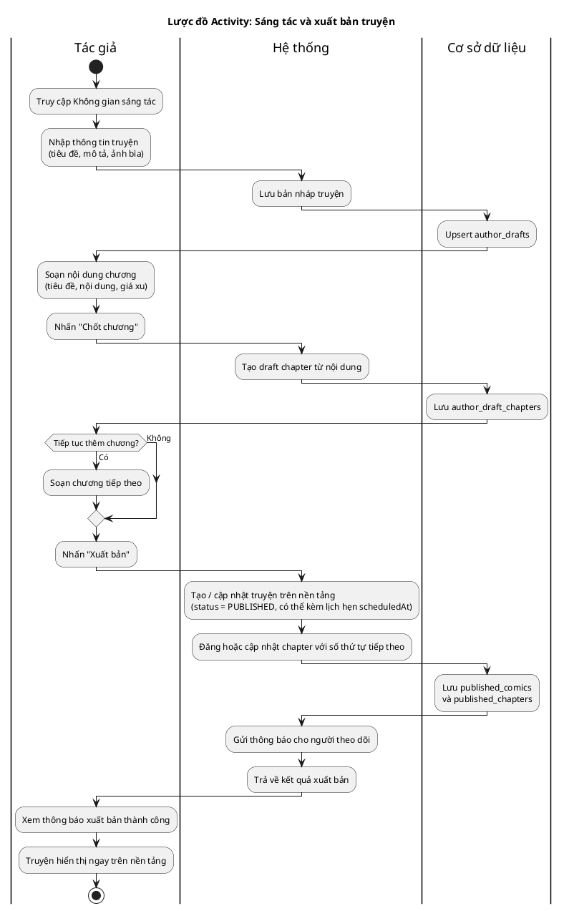
```plantuml
@startuml
title Lược đồ Activity: Sáng tác và xuất bản truyện

|Tác giả|
|Hệ thống|
|Cơ sở dữ liệu|

|Tác giả|
start
:Truy cập Không gian sáng tác;
:Nhập thông tin truyện\n(tiêu đề, mô tả, ảnh bìa);

|Hệ thống|
:Lưu bản nháp truyện;
|Cơ sở dữ liệu|
:Upsert author_drafts;

|Tác giả|
:Soạn nội dung chương\n(tiêu đề, nội dung, giá xu);
:Nhấn "Chốt chương";

|Hệ thống|
:Tạo draft chapter từ nội dung;
|Cơ sở dữ liệu|
:Lưu author_draft_chapters;

|Tác giả|
if (Tiếp tục thêm chương?) then (Có)
  :Soạn chương tiếp theo;
else (Không)
endif

:Nhấn "Xuất bản";

|Hệ thống|
:Tạo / cập nhật truyện trên nền tảng\n(status = PUBLISHED, có thể kèm lịch hẹn scheduledAt);
:Đăng hoặc cập nhật chapter với số thứ tự tiếp theo;
|Cơ sở dữ liệu|
:Lưu published_comics\nvà published_chapters;

|Hệ thống|
:Gửi thông báo cho người theo dõi;
:Trả về kết quả xuất bản;

|Tác giả|
:Xem thông báo xuất bản thành công;
:Truyện hiển thị ngay trên nền tảng;

stop
@enduml
```

---

## 6. Rút tiền doanh thu

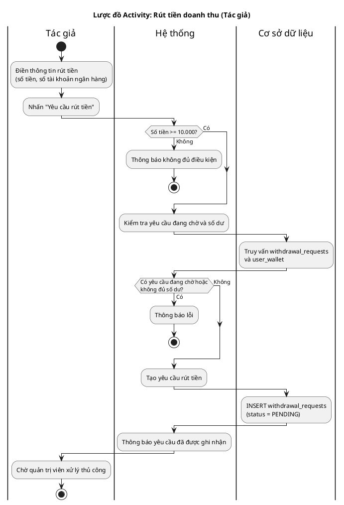
```plantuml
@startuml
title Lược đồ Activity: Rút tiền doanh thu (Tác giả)

|Tác giả|
|Hệ thống|
|Cơ sở dữ liệu|

|Tác giả|
start
:Điền thông tin rút tiền\n(số tiền, số tài khoản ngân hàng);
:Nhấn "Yêu cầu rút tiền";

|Hệ thống|
if (Số tiền >= 10.000?) then (Không)
  :Thông báo không đủ điều kiện;
  stop
else (Có)
endif

:Kiểm tra yêu cầu đang chờ và số dư;
|Cơ sở dữ liệu|
:Truy vấn withdrawal_requests\nvà user_wallet;

|Hệ thống|
if (Có yêu cầu đang chờ hoặc\nkhông đủ số dư?) then (Có)
  :Thông báo lỗi;
  stop
else (Không)
endif

:Tạo yêu cầu rút tiền;
|Cơ sở dữ liệu|
:INSERT withdrawal_requests\n(status = PENDING);

|Hệ thống|
:Thông báo yêu cầu đã được ghi nhận;

|Tác giả|
:Chờ quản trị viên xử lý thủ công;

stop
@enduml
```

---

## 7. Báo cáo nội dung vi phạm

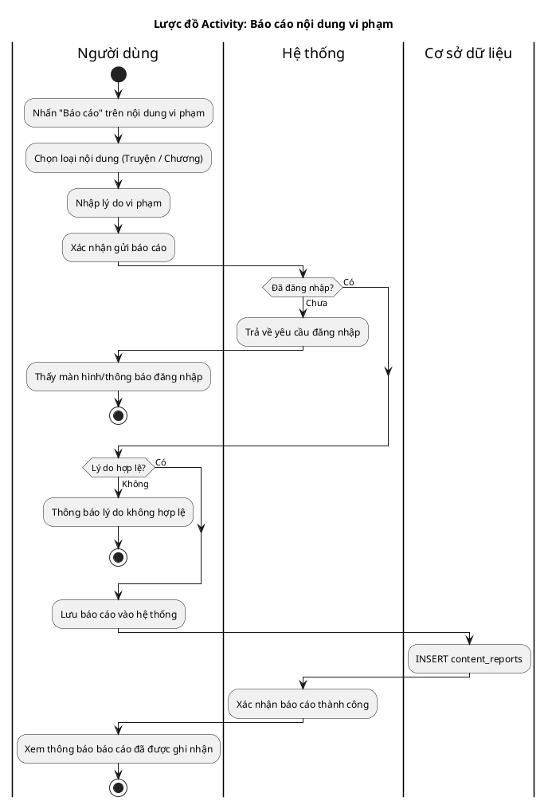
```plantuml
@startuml
title Lược đồ Activity: Báo cáo nội dung vi phạm

|Người dùng|
|Hệ thống|
|Cơ sở dữ liệu|

|Người dùng|
start
:Nhấn "Báo cáo" trên nội dung vi phạm;
:Chọn loại nội dung (Truyện / Chương);
:Nhập lý do vi phạm;
:Xác nhận gửi báo cáo;

|Hệ thống|
if (Đã đăng nhập?) then (Chưa)
  :Trả về yêu cầu đăng nhập;
  |Người dùng|
  :Thấy màn hình/thông báo đăng nhập;
  stop
else (Có)
endif

if (Lý do hợp lệ?) then (Không)
  :Thông báo lý do không hợp lệ;
  stop
else (Có)
endif

:Lưu báo cáo vào hệ thống;
|Cơ sở dữ liệu|
:INSERT content_reports;

|Hệ thống|
:Xác nhận báo cáo thành công;

|Người dùng|
:Xem thông báo báo cáo đã được ghi nhận;

stop
@enduml
```

---

## 8a. Theo dõi truyện

Tiền-điều-kiện: Người dùng đã đăng nhập.

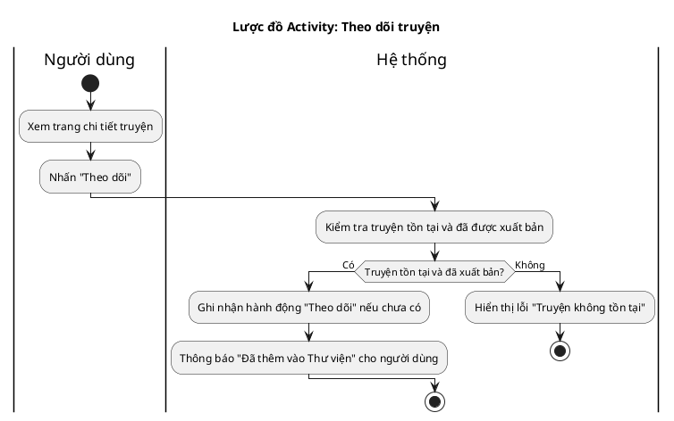
```plantuml
@startuml
title Lược đồ Activity: Theo dõi truyện

|Người dùng|
|Hệ thống|

|Người dùng|
start
:Xem trang chi tiết truyện;
:Nhấn "Theo dõi";

|Hệ thống|
:Kiểm tra truyện tồn tại và đã được xuất bản;
if (Truyện tồn tại và đã xuất bản?) then (Có)
  :Ghi nhận hành động "Theo dõi" nếu chưa có;
  :Thông báo "Đã thêm vào Thư viện" cho người dùng;
else (Không)
  :Hiển thị lỗi "Truyện không tồn tại";
  stop
endif

stop
@enduml
```

---

## 8b. Theo dõi tác giả

Tiền-điều-kiện: Người dùng đã đăng nhập.

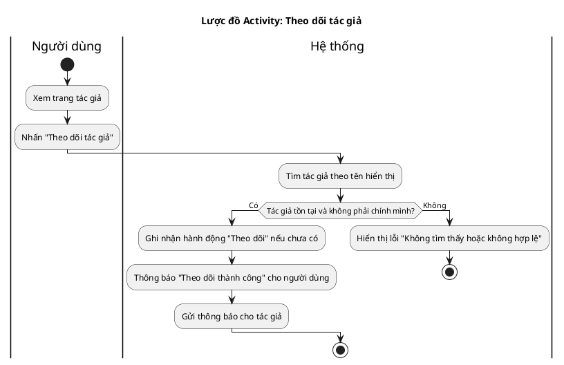
```plantuml
@startuml
title Lược đồ Activity: Theo dõi tác giả

|Người dùng|
|Hệ thống|

|Người dùng|
start
:Xem trang tác giả;
:Nhấn "Theo dõi tác giả";

|Hệ thống|
:Tìm tác giả theo tên hiển thị;
if (Tác giả tồn tại và không phải chính mình?) then (Có)
  :Ghi nhận hành động "Theo dõi" nếu chưa có;
  :Thông báo "Theo dõi thành công" cho người dùng;
  :Gửi thông báo cho tác giả;
else (Không)
  :Hiển thị lỗi "Không tìm thấy hoặc không hợp lệ";
  stop
endif

stop
@enduml
```

---

## 9. Đánh giá truyện

Tiền-điều-kiện: Người dùng đã đăng nhập.

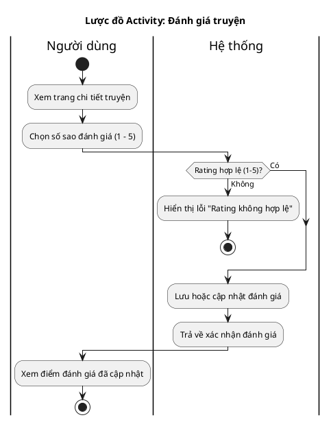
```plantuml
@startuml
title Lược đồ Activity: Đánh giá truyện

|Người dùng|
|Hệ thống|

|Người dùng|
start
:Xem trang chi tiết truyện;
:Chọn số sao đánh giá (1 - 5);

|Hệ thống|
if (Rating hợp lệ (1-5)?) then (Không)
  :Hiển thị lỗi "Rating không hợp lệ";
  stop
else (Có)
endif

|Hệ thống|
:Lưu hoặc cập nhật đánh giá;
:Trả về xác nhận đánh giá;

|Người dùng|
:Xem điểm đánh giá đã cập nhật;

stop
@enduml
```

---

## 10. Nghe truyện (Text to Speech)

### Đặc tả chức năng

**Tên use case:** Nghe truyện (Text to Speech)

**Tác nhân:** Người dùng (không yêu cầu đăng nhập)

**Mô tả:** Người dùng bật chức năng nghe truyện để hệ thống tự động đọc nội dung văn bản của chương truyện thành tiếng, hỗ trợ điều chỉnh tốc độ, giọng đọc và nhảy đến đoạn bất kỳ.

**Tiền điều kiện:**
- Chương truyện không bị khóa.
- Chương truyện là dạng văn bản (không phải ảnh/manga).
- Trình duyệt hỗ trợ Web Speech API (`window.speechSynthesis`).

**Hậu điều kiện:** Nội dung chương được đọc thành tiếng; đoạn văn và từ đang đọc được highlight trên màn hình.

**Luồng sự kiện chính:**
1. Người dùng mở trang đọc chương truyện văn bản.
2. Hệ thống kiểm tra trình duyệt hỗ trợ TTS, chương không bị khóa và không phải dạng ảnh, sau đó hiển thị nút "Nghe truyện".
3. Người dùng nhấn "Nghe truyện" để mở panel điều khiển TTS.
4. Hệ thống tải danh sách giọng đọc (ưu tiên tiếng Việt vi-VN), tự động chọn giọng nữ đầu tiên hoặc dùng cài đặt đã lưu.
5. Người dùng nhấn nút Phát.
6. Hệ thống tách nội dung thành từng đoạn văn, lần lượt tổng hợp và phát âm thanh từng đoạn.
7. Trong lúc đọc, hệ thống highlight đoạn đang đọc (nền xanh, tự động scroll) và highlight từng từ đang đọc (nền vàng).
8. Khi đọc xong đoạn cuối, hệ thống reset trạng thái về mặc định.

**Luồng sự kiện thay thế:**
- **Tạm dừng / Tiếp tục:** Người dùng nhấn Tạm dừng → hệ thống dừng phát; nhấn Tiếp tục → hệ thống phát lại từ vị trí đang dừng.
- **Dừng hẳn:** Người dùng nhấn Dừng → hệ thống hủy phát, xóa highlight, reset về trạng thái ban đầu.
- **Thay đổi tốc độ hoặc giọng đọc giữa chừng:** Hệ thống lưu cài đặt mới vào localStorage, dừng utterance hiện tại và phát lại từ đoạn đang dở với cài đặt mới.
- **Lọc giọng theo giới tính:** Người dùng chọn Nữ / Nam / Tất cả → hệ thống lọc danh sách và tự động chọn giọng đầu tiên trong danh sách lọc.
- **Nhảy đến đoạn bất kỳ:** Người dùng click vào đoạn văn bất kỳ → hệ thống hủy utterance hiện tại và bắt đầu đọc từ đoạn được chọn.

**Công nghệ:** Sử dụng tính năng đọc văn bản có sẵn của trình duyệt (`Web Speech API`), không dùng AI hay dịch vụ bên ngoài. Giọng đọc lấy từ hệ điều hành của máy người dùng nên có thể khác nhau tùy thiết bị.

**Luồng ngoại lệ:**
- Trình duyệt không hỗ trợ → ẩn nút "Nghe truyện", hiển thị thông báo không hỗ trợ.
- Lỗi phát sinh khi đọc → dừng phát, reset trạng thái.

---

### Activity Diagram

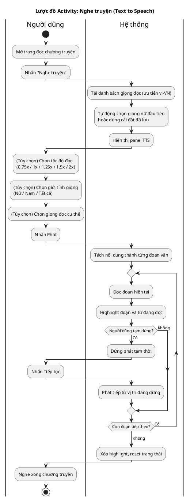
```plantuml
@startuml
title Lược đồ Activity: Nghe truyện (Text to Speech)

|Người dùng|
|Hệ thống|

|Người dùng|
start
:Mở trang đọc chương truyện;

|Người dùng|
:Nhấn "Nghe truyện";

|Hệ thống|
:Tải danh sách giọng đọc (ưu tiên vi-VN);
:Tự động chọn giọng nữ đầu tiên\nhoặc dùng cài đặt đã lưu;
:Hiển thị panel TTS;

|Người dùng|
:(Tùy chọn) Chọn tốc độ đọc\n(0.75x / 1x / 1.25x / 1.5x / 2x);
:(Tùy chọn) Chọn giới tính giọng\n(Nữ / Nam / Tất cả);
:(Tùy chọn) Chọn giọng đọc cụ thể;
:Nhấn Phát;

|Hệ thống|
:Tách nội dung thành từng đoạn văn;

repeat
  :Đọc đoạn hiện tại;
  :Highlight đoạn và từ đang đọc;

  if (Người dùng tạm dừng?) then (Có)
    :Dừng phát tạm thời;
    |Người dùng|
    :Nhấn Tiếp tục;
    |Hệ thống|
    :Phát tiếp từ vị trí đang dừng;
  else (Không)
  endif

repeat while (Còn đoạn tiếp theo?) is (Có)
->Không;

:Xóa highlight, reset trạng thái;

|Người dùng|
:Nghe xong chương truyện;

stop
@enduml
```

---

## 11. Đăng ký tài khoản

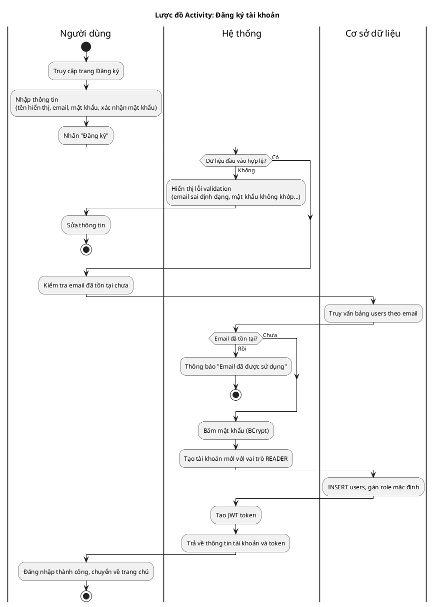
```plantuml
@startuml
title Lược đồ Activity: Đăng ký tài khoản

|Người dùng|
|Hệ thống|
|Cơ sở dữ liệu|

|Người dùng|
start
:Truy cập trang Đăng ký;
:Nhập thông tin\n(tên hiển thị, email, mật khẩu, xác nhận mật khẩu);
:Nhấn "Đăng ký";

|Hệ thống|
if (Dữ liệu đầu vào hợp lệ?) then (Không)
  :Hiển thị lỗi validation\n(email sai định dạng, mật khẩu không khớp...);
  |Người dùng|
  :Sửa thông tin;
  stop
else (Có)
endif

:Kiểm tra email đã tồn tại chưa;
|Cơ sở dữ liệu|
:Truy vấn bảng users theo email;

|Hệ thống|
if (Email đã tồn tại?) then (Rồi)
  :Thông báo "Email đã được sử dụng";
  stop
else (Chưa)
endif

:Băm mật khẩu (BCrypt);
:Tạo tài khoản mới với vai trò READER;
|Cơ sở dữ liệu|
:INSERT users, gán role mặc định;

|Hệ thống|
:Tạo JWT token;
:Trả về thông tin tài khoản và token;

|Người dùng|
:Đăng nhập thành công, chuyển về trang chủ;

stop
@enduml
```

---

## 12. Đăng nhập tài khoản

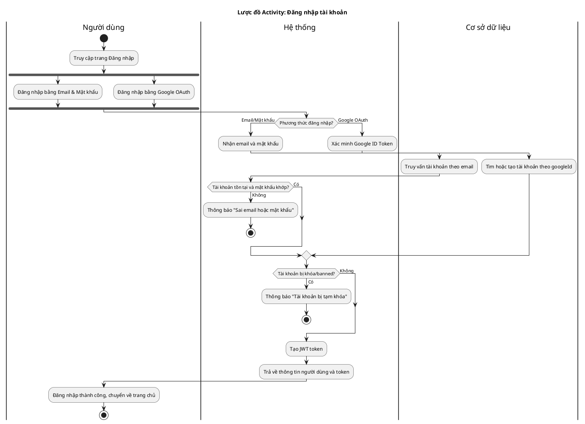
```plantuml
@startuml
title Lược đồ Activity: Đăng nhập tài khoản

|Người dùng|
|Hệ thống|
|Cơ sở dữ liệu|

|Người dùng|
start
:Truy cập trang Đăng nhập;

fork
  :Đăng nhập bằng Email & Mật khẩu;
fork again
  :Đăng nhập bằng Google OAuth;
end fork

|Hệ thống|
if (Phương thức đăng nhập?) then (Email/Mật khẩu)
  :Nhận email và mật khẩu;
  |Cơ sở dữ liệu|
  :Truy vấn tài khoản theo email;
  |Hệ thống|
  if (Tài khoản tồn tại và mật khẩu khớp?) then (Có)
  else (Không)
    :Thông báo "Sai email hoặc mật khẩu";
    stop
  endif
else (Google OAuth)
  :Xác minh Google ID Token;
  |Cơ sở dữ liệu|
  :Tìm hoặc tạo tài khoản theo googleId;
  |Hệ thống|
endif

if (Tài khoản bị khóa/banned?) then (Có)
  :Thông báo "Tài khoản bị tạm khóa";
  stop
else (Không)
endif

:Tạo JWT token;
:Trả về thông tin người dùng và token;

|Người dùng|
:Đăng nhập thành công, chuyển về trang chủ;

stop
@enduml
```

---

## 13. Quản lý hồ sơ cá nhân

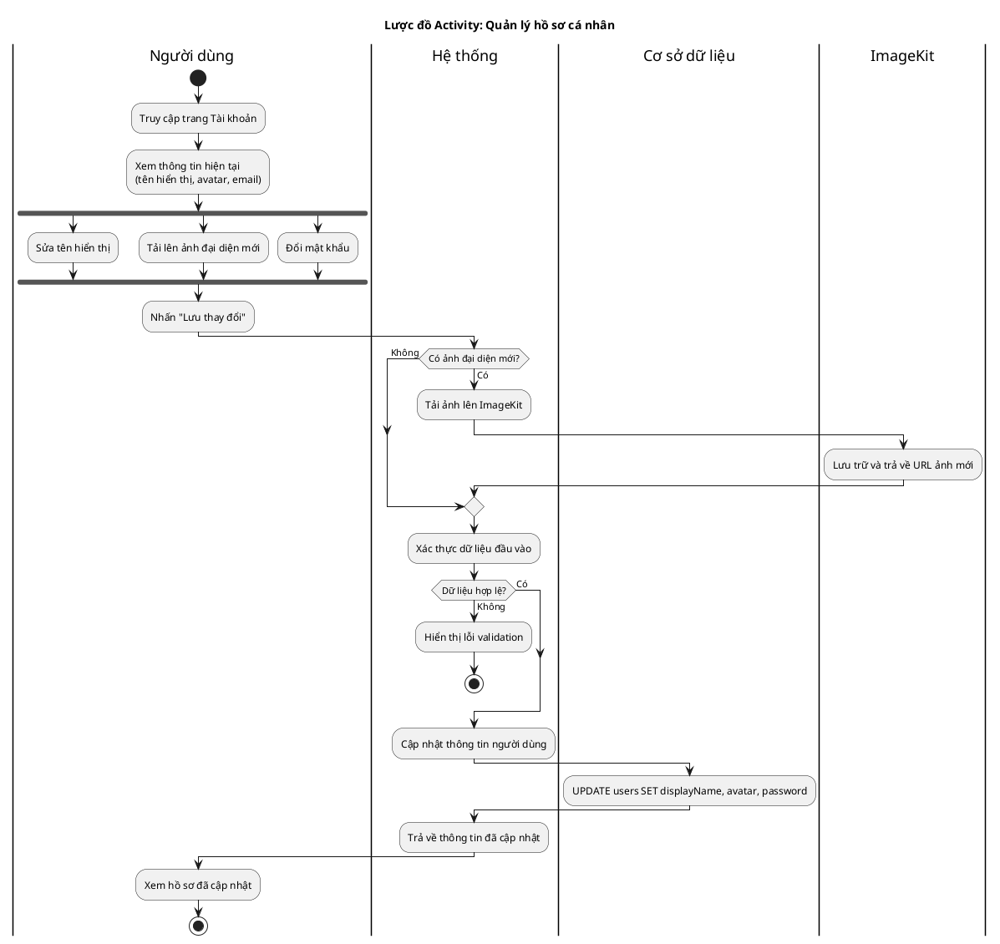
```plantuml
@startuml
title Lược đồ Activity: Quản lý hồ sơ cá nhân

|Người dùng|
|Hệ thống|
|Cơ sở dữ liệu|
|ImageKit|

|Người dùng|
start
:Truy cập trang Tài khoản;
:Xem thông tin hiện tại\n(tên hiển thị, avatar, email);

fork
  :Sửa tên hiển thị;
fork again
  :Tải lên ảnh đại diện mới;
fork again
  :Đổi mật khẩu;
end fork

|Người dùng|
:Nhấn "Lưu thay đổi";

|Hệ thống|
if (Có ảnh đại diện mới?) then (Có)
  :Tải ảnh lên ImageKit;
  |ImageKit|
  :Lưu trữ và trả về URL ảnh mới;
  |Hệ thống|
else (Không)
endif

:Xác thực dữ liệu đầu vào;
if (Dữ liệu hợp lệ?) then (Không)
  :Hiển thị lỗi validation;
  stop
else (Có)
endif

:Cập nhật thông tin người dùng;
|Cơ sở dữ liệu|
:UPDATE users SET displayName, avatar, password;

|Hệ thống|
:Trả về thông tin đã cập nhật;

|Người dùng|
:Xem hồ sơ đã cập nhật;

stop
@enduml
```

---

## 14. Tìm kiếm truyện

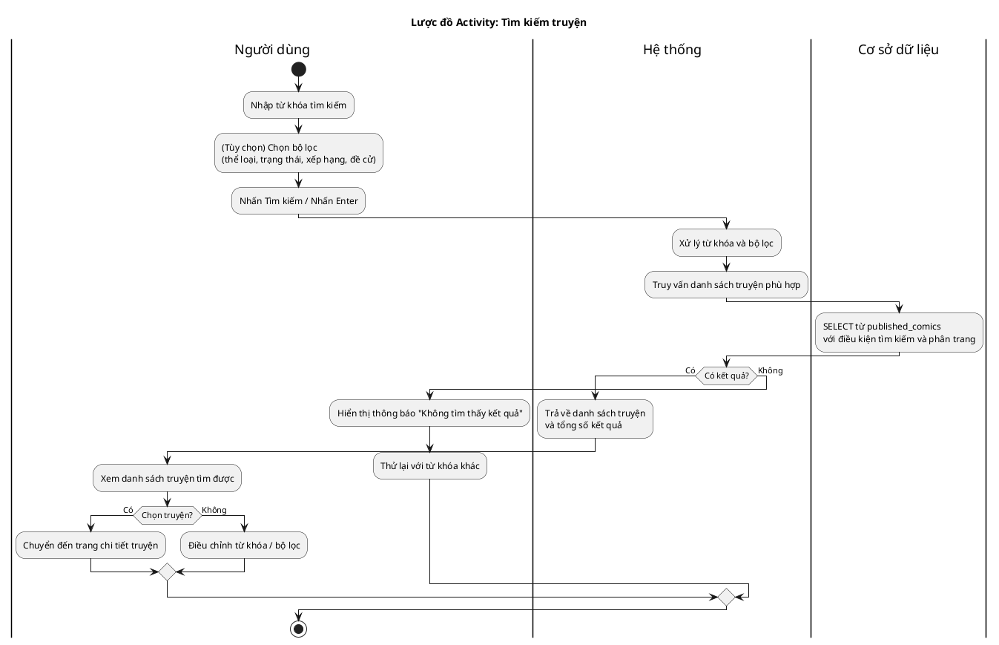
```plantuml
@startuml
title Lược đồ Activity: Tìm kiếm truyện

|Người dùng|
|Hệ thống|
|Cơ sở dữ liệu|

|Người dùng|
start
:Nhập từ khóa tìm kiếm;
:(Tùy chọn) Chọn bộ lọc\n(thể loại, trạng thái, xếp hạng, đề cử);
:Nhấn Tìm kiếm / Nhấn Enter;

|Hệ thống|
:Xử lý từ khóa và bộ lọc;
:Truy vấn danh sách truyện phù hợp;
|Cơ sở dữ liệu|
:SELECT từ published_comics\nvới điều kiện tìm kiếm và phân trang;

|Hệ thống|
if (Có kết quả?) then (Có)
  :Trả về danh sách truyện\nvà tổng số kết quả;
  |Người dùng|
  :Xem danh sách truyện tìm được;

  if (Chọn truyện?) then (Có)
    :Chuyển đến trang chi tiết truyện;
  else (Không)
    :Điều chỉnh từ khóa / bộ lọc;
  endif
else (Không)
  :Hiển thị thông báo "Không tìm thấy kết quả";
  |Người dùng|
  :Thử lại với từ khóa khác;
endif

stop
@enduml
```

---

## 15. Bình luận chương truyện

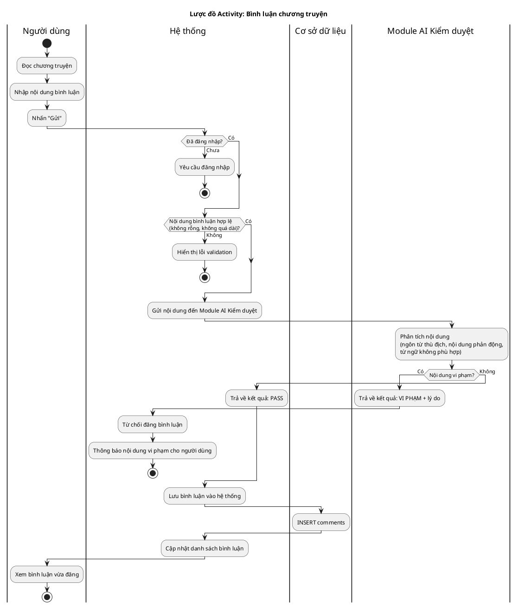
```plantuml
@startuml
title Lược đồ Activity: Bình luận chương truyện

|Người dùng|
|Hệ thống|
|Cơ sở dữ liệu|
|Module AI Kiểm duyệt|

|Người dùng|
start
:Đọc chương truyện;
:Nhập nội dung bình luận;
:Nhấn "Gửi";

|Hệ thống|
if (Đã đăng nhập?) then (Chưa)
  :Yêu cầu đăng nhập;
  stop
else (Có)
endif

if (Nội dung bình luận hợp lệ\n(không rỗng, không quá dài)?) then (Không)
  :Hiển thị lỗi validation;
  stop
else (Có)
endif

:Gửi nội dung đến Module AI Kiểm duyệt;
|Module AI Kiểm duyệt|
:Phân tích nội dung\n(ngôn từ thù địch, nội dung phản động,\ntừ ngữ không phù hợp);
if (Nội dung vi phạm?) then (Có)
  :Trả về kết quả: VI PHẠM + lý do;
  |Hệ thống|
  :Từ chối đăng bình luận;
  :Thông báo nội dung vi phạm cho người dùng;
  stop
else (Không)
  :Trả về kết quả: PASS;
endif

|Hệ thống|
:Lưu bình luận vào hệ thống;
|Cơ sở dữ liệu|
:INSERT comments;

|Hệ thống|
:Cập nhật danh sách bình luận;

|Người dùng|
:Xem bình luận vừa đăng;

stop
@enduml
```

---

## 16. Lịch sử đọc truyện

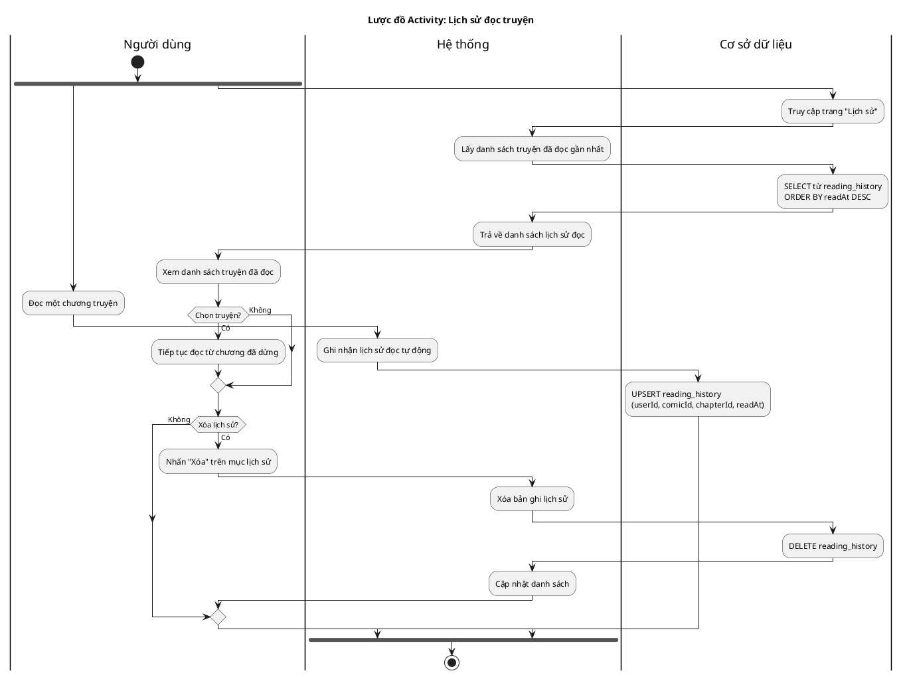
```plantuml
@startuml
title Lược đồ Activity: Lịch sử đọc truyện

|Người dùng|
|Hệ thống|
|Cơ sở dữ liệu|

|Người dùng|
start

fork
  :Đọc một chương truyện;
  |Hệ thống|
  :Ghi nhận lịch sử đọc tự động;
  |Cơ sở dữ liệu|
  :UPSERT reading_history\n(userId, comicId, chapterId, readAt);
fork again
  :Truy cập trang "Lịch sử";
  |Hệ thống|
  :Lấy danh sách truyện đã đọc gần nhất;
  |Cơ sở dữ liệu|
  :SELECT từ reading_history\nORDER BY readAt DESC;
  |Hệ thống|
  :Trả về danh sách lịch sử đọc;
  |Người dùng|
  :Xem danh sách truyện đã đọc;

  if (Chọn truyện?) then (Có)
    :Tiếp tục đọc từ chương đã dừng;
  else (Không)
  endif

  if (Xóa lịch sử?) then (Có)
    :Nhấn "Xóa" trên mục lịch sử;
    |Hệ thống|
    :Xóa bản ghi lịch sử;
    |Cơ sở dữ liệu|
    :DELETE reading_history;
    |Hệ thống|
    :Cập nhật danh sách;
  else (Không)
  endif
end fork

stop
@enduml
```

---

## 17. Quản lý thông báo

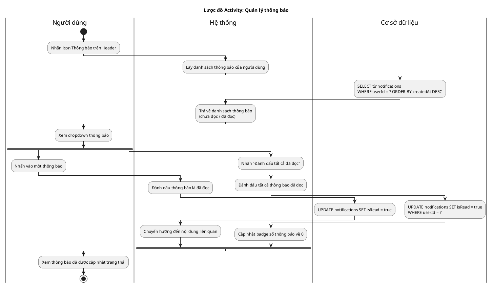
```plantuml
@startuml
title Lược đồ Activity: Quản lý thông báo

|Người dùng|
|Hệ thống|
|Cơ sở dữ liệu|

|Người dùng|
start
:Nhấn icon Thông báo trên Header;

|Hệ thống|
:Lấy danh sách thông báo của người dùng;
|Cơ sở dữ liệu|
:SELECT từ notifications\nWHERE userId = ? ORDER BY createdAt DESC;

|Hệ thống|
:Trả về danh sách thông báo\n(chưa đọc / đã đọc);

|Người dùng|
:Xem dropdown thông báo;

fork
  :Nhấn vào một thông báo;
  |Hệ thống|
  :Đánh dấu thông báo là đã đọc;
  |Cơ sở dữ liệu|
  :UPDATE notifications SET isRead = true;
  |Hệ thống|
  :Chuyển hướng đến nội dung liên quan;
fork again
  :Nhấn "Đánh dấu tất cả đã đọc";
  |Hệ thống|
  :Đánh dấu tất cả thông báo đã đọc;
  |Cơ sở dữ liệu|
  :UPDATE notifications SET isRead = true\nWHERE userId = ?;
  |Hệ thống|
  :Cập nhật badge số thông báo về 0;
end fork

|Người dùng|
:Xem thông báo đã được cập nhật trạng thái;

stop
@enduml
```

---

## 18. Admin kiểm duyệt báo cáo nội dung

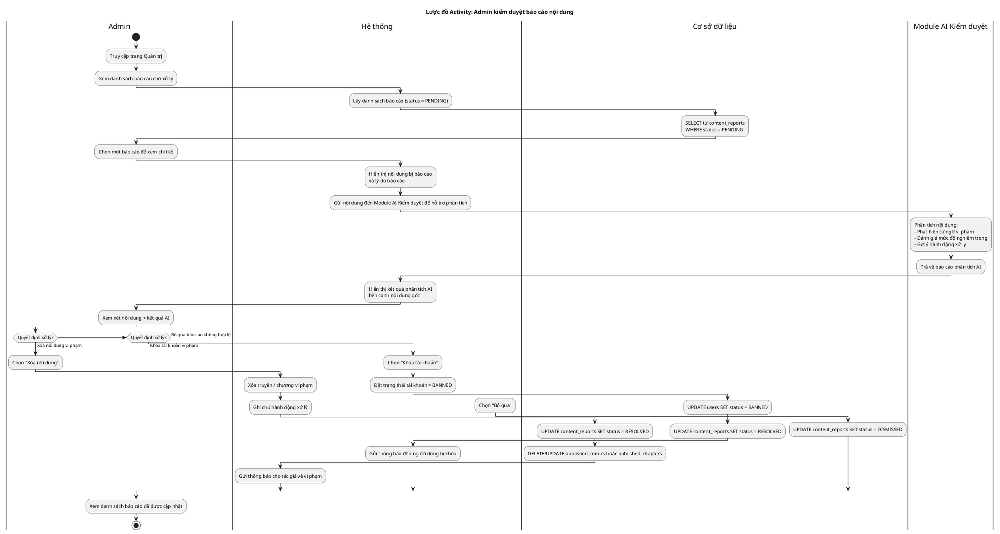
```plantuml
@startuml
title Lược đồ Activity: Admin kiểm duyệt báo cáo nội dung

|Admin|
|Hệ thống|
|Cơ sở dữ liệu|
|Module AI Kiểm duyệt|

|Admin|
start
:Truy cập trang Quản trị;
:Xem danh sách báo cáo chờ xử lý;

|Hệ thống|
:Lấy danh sách báo cáo (status = PENDING);
|Cơ sở dữ liệu|
:SELECT từ content_reports\nWHERE status = PENDING;

|Admin|
:Chọn một báo cáo để xem chi tiết;

|Hệ thống|
:Hiển thị nội dung bị báo cáo\nvà lý do báo cáo;
:Gửi nội dung đến Module AI Kiểm duyệt để hỗ trợ phân tích;
|Module AI Kiểm duyệt|
:Phân tích nội dung:\n- Phát hiện từ ngữ vi phạm\n- Đánh giá mức độ nghiêm trọng\n- Gợi ý hành động xử lý;
:Trả về báo cáo phân tích AI;

|Hệ thống|
:Hiển thị kết quả phân tích AI\nbên cạnh nội dung gốc;

|Admin|
:Xem xét nội dung + kết quả AI;

if (Quyết định xử lý?) then (Xóa nội dung vi phạm)
  :Chọn "Xóa nội dung";
  |Hệ thống|
  :Xóa truyện / chương vi phạm;
  :Ghi chú hành động xử lý;
  |Cơ sở dữ liệu|
  :UPDATE content_reports SET status = RESOLVED;
  :DELETE/UPDATE published_comics hoặc published_chapters;
  |Hệ thống|
  :Gửi thông báo cho tác giả về vi phạm;
else if (Quyết định xử lý?) then (Khóa tài khoản vi phạm)
  :Chọn "Khóa tài khoản";
  |Hệ thống|
  :Đặt trạng thái tài khoản = BANNED;
  |Cơ sở dữ liệu|
  :UPDATE users SET status = BANNED;
  :UPDATE content_reports SET status = RESOLVED;
  |Hệ thống|
  :Gửi thông báo đến người dùng bị khóa;
else (Bỏ qua báo cáo không hợp lệ)
  :Chọn "Bỏ qua";
  |Hệ thống|
  |Cơ sở dữ liệu|
  :UPDATE content_reports SET status = DISMISSED;
endif

|Admin|
:Xem danh sách báo cáo đã được cập nhật;

stop
@enduml
```

---

## 19. Kiểm duyệt nội dung bằng AI khi xuất bản chương (Chống Reup & Vi phạm)

### Đặc tả chức năng

**Tên use case:** Kiểm duyệt nội dung AI khi xuất bản

**Tác nhân:** Tác giả, Hệ thống AI Kiểm duyệt

**Mô tả:** Khi tác giả xuất bản chương truyện, hệ thống tự động sử dụng AI để kiểm tra hai vấn đề: (1) nội dung vi phạm (ngôn từ phản động, nội dung đồi trụy, nội dung cấm), và (2) chống reup (đạo văn, sao chép từ nguồn khác mà không có quyền). Hệ thống hỗ trợ Admin ra quyết định nhưng Admin có quyền phán quyết cuối cùng.

**Công nghệ AI sử dụng:**
- **Kiểm duyệt nội dung vi phạm:** Sử dụng mô hình phân loại văn bản (Text Classification) như Perspective API của Google hoặc mô hình fine-tuned trên tập dữ liệu tiếng Việt (ViHOS dataset - Vietnamese Hate and Offensive Speech dataset, UIT-ViCTSD - Vietnamese Constructive and Toxic Speech Detection).
- **Phát hiện reup (đạo văn):** So sánh độ tương đồng văn bản sử dụng TF-IDF + Cosine Similarity hoặc BERT-based Sentence Embedding (PhoBERT cho tiếng Việt) để tìm đoạn văn trùng lặp với kho dữ liệu đã xuất bản.

**Tập dữ liệu tham khảo để huấn luyện/đánh giá:**
- ViHOS: Phát hiện ngôn từ thù địch tiếng Việt
- UIT-ViCTSD: Phát hiện nội dung độc hại tiếng Việt
- VLSP 2019 Hate Speech Detection dataset

```plantuml
@startuml
title Lược đồ Activity: Kiểm duyệt nội dung AI khi xuất bản chương

|Tác giả|
|Hệ thống|
|AI - Kiểm duyệt vi phạm|
|AI - Phát hiện Reup|
|Cơ sở dữ liệu|
|Admin|

|Tác giả|
start
:Nhấn "Xuất bản" chương truyện;

|Hệ thống|
:Trích xuất nội dung văn bản chương;

fork
  note right: Kiểm tra song song
  :Gửi nội dung đến AI Kiểm duyệt vi phạm;
  |AI - Kiểm duyệt vi phạm|
  :Phân tích nội dung theo các hạng mục:\n- Ngôn từ thù địch / phân biệt chủng tộc\n- Nội dung đồi trụy / người lớn\n- Nội dung phản động, chính trị nhạy cảm\n- Thông tin sai lệch nguy hiểm;
  :Tính điểm vi phạm (0.0 - 1.0)\nvà xác định hạng mục vi phạm;
  :Trả về: điểm vi phạm + hạng mục + đoạn văn cụ thể;

fork again
  :Gửi nội dung đến AI Phát hiện Reup;
  |AI - Phát hiện Reup|
  :Mã hóa văn bản thành vector\n(PhoBERT Sentence Embedding);
  :So sánh Cosine Similarity\nvới kho văn bản đã xuất bản;
  :Tìm các đoạn trùng lặp\n(similarity >= ngưỡng cấu hình);
  :Trả về: điểm tương đồng + nguồn gốc truyện\n+ đoạn văn trùng lặp cụ thể;
end fork

|Hệ thống|
:Tổng hợp kết quả từ hai module AI;

if (Điểm vi phạm > ngưỡng CAO\nHOẶC tỷ lệ reup > ngưỡng CAO?) then (Có)
  :Tự động TỪ CHỐI xuất bản;
  :Tạo báo cáo vi phạm chi tiết;
  |Cơ sở dữ liệu|
  :Lưu báo cáo vào content_reports\n(status = AUTO_REJECTED);
  |Hệ thống|
  :Thông báo cho Tác giả\n(lý do + đoạn văn vi phạm cụ thể);
  |Tác giả|
  :Xem báo cáo lý do từ chối;
  :Chỉnh sửa và xuất bản lại;
  stop
else if (Điểm vi phạm > ngưỡng TRUNG BÌNH\nHOẶC tỷ lệ reup > ngưỡng TRUNG BÌNH?) then (Có — Cần xét duyệt)
  :Đặt trạng thái chương = PENDING_REVIEW;
  :Tạo tác vụ xét duyệt cho Admin;
  |Cơ sở dữ liệu|
  :Lưu chapter với status = PENDING_REVIEW\nvà lưu kết quả AI phân tích;
  |Hệ thống|
  :Thông báo cho Admin có nội dung cần xét duyệt;
  :Thông báo cho Tác giả "Đang chờ xét duyệt";

  |Admin|
  :Xem xét nội dung + kết quả phân tích AI;
  :Đọc chi tiết đoạn vi phạm được AI đánh dấu;

  if (Admin quyết định?) then (Duyệt cho xuất bản)
    |Hệ thống|
    :Xuất bản chương (status = PUBLISHED);
    :Gửi thông báo đến người theo dõi;
    |Tác giả|
    :Nhận thông báo chương được duyệt;
  else (Từ chối)
    |Hệ thống|
    :Thông báo từ chối kèm lý do Admin;
    |Tác giả|
    :Nhận thông báo từ chối;
    :Chỉnh sửa và xuất bản lại;
  endif
else (Không — Sạch)
  :Xuất bản chương ngay lập tức\n(status = PUBLISHED);
  |Cơ sở dữ liệu|
  :Lưu published_chapters;
  |Hệ thống|
  :Gửi thông báo đến người theo dõi;
  |Tác giả|
  :Xem thông báo xuất bản thành công;
endif

stop
@enduml
```

---

## 20. Kiểm tra bản quyền hình ảnh bìa

### Đặc tả chức năng

**Tên use case:** Kiểm tra bản quyền hình ảnh bìa

**Tác nhân:** Tác giả, Hệ thống AI nhận dạng hình ảnh

**Mô tả:** Khi tác giả tải lên ảnh bìa cho truyện, hệ thống tự động sử dụng reverse image search và AI nhận dạng nội dung hình ảnh để phát hiện hình ảnh vi phạm bản quyền hoặc nội dung không phù hợp (đồi trụy, bạo lực).

**Công nghệ AI sử dụng:**
- **Nhận dạng nội dung ảnh (NSFW Detection):** Sử dụng các API sẵn có như Google Cloud Vision API (SafeSearch Detection) hoặc Microsoft Azure Content Moderator để phát hiện ảnh người lớn, bạo lực, nội dung nhạy cảm.
- **Kiểm tra trùng lặp hình ảnh:** Sử dụng Perceptual Hashing (pHash) để so sánh ảnh với kho ảnh đã đăng ký, phát hiện ảnh bị sao chép có sửa đổi nhẹ.

**Cặp công nghệ đối xứng để so sánh:**
| Nhiệm vụ | Công nghệ A | Công nghệ B |
|---|---|---|
| NSFW Detection | Google Vision SafeSearch | Azure Content Moderator |
| Image Dedup | pHash (Perceptual Hash) | CLIP Embedding + Cosine Similarity |
| Reverse Search | SerpAPI Google Images | TinEye API |

```plantuml
@startuml
title Lược đồ Activity: Kiểm tra bản quyền hình ảnh bìa

|Tác giả|
|Hệ thống|
|AI - Nhận dạng nội dung ảnh|
|AI - Kiểm tra trùng lặp ảnh|
|Cơ sở dữ liệu|

|Tác giả|
start
:Tải lên ảnh bìa truyện;

|Hệ thống|
:Nhận file ảnh;
:Tải ảnh lên ImageKit (lưu trữ tạm);

fork
  note right: Kiểm tra song song
  :Gửi ảnh đến AI Nhận dạng nội dung;
  |AI - Nhận dạng nội dung ảnh|
  :Phân tích ảnh theo các hạng mục:\n- Adult (nội dung người lớn)\n- Violence (bạo lực)\n- Racy (nội dung gợi cảm)\n- Spoof (nội dung giả mạo);
  :Tính điểm từng hạng mục (0.0 - 1.0);
  :Trả về kết quả SafeSearch;

fork again
  :Tính pHash của ảnh tải lên;
  |AI - Kiểm tra trùng lặp ảnh|
  :So sánh pHash với kho ảnh bìa đã đăng ký;
  :Tính khoảng cách Hamming;
  :Tìm ảnh tương đồng\n(khoảng cách <= ngưỡng);
  :Trả về: danh sách ảnh trùng lặp\nvà truyện nguồn tương ứng;
end fork

|Hệ thống|
:Tổng hợp kết quả kiểm tra;

if (Ảnh chứa nội dung vi phạm\n(Adult/Violence cao)?) then (Có)
  :Từ chối ảnh bìa;
  :Xóa ảnh tạm khỏi ImageKit;
  :Thông báo lý do từ chối cho Tác giả;
  |Tác giả|
  :Tải lên ảnh bìa khác;
  stop
else if (Ảnh trùng lặp với bìa truyện khác?) then (Có)
  :Hiển thị cảnh báo bản quyền;
  :Hiển thị truyện nguồn có ảnh tương đồng;
  |Tác giả|
  if (Tác giả xác nhận có quyền dùng ảnh?) then (Có)
    |Hệ thống|
    :Chấp nhận ảnh bìa;
    :Lưu URL ảnh chính thức;
    |Cơ sở dữ liệu|
    :Lưu pHash vào kho ảnh đã đăng ký;
  else (Không)
    :Tải lên ảnh bìa khác;
    stop
  endif
else (Không vi phạm)
  :Chấp nhận ảnh bìa;
  :Lưu URL ảnh chính thức;
  |Cơ sở dữ liệu|
  :Lưu pHash vào kho ảnh đã đăng ký;
  |Tác giả|
  :Ảnh bìa được dùng cho truyện;
endif

stop
@enduml
```

---

## 21. Quản lý tủ truyện / Thư viện cá nhân

```plantuml
@startuml
title Lược đồ Activity: Quản lý tủ truyện / Thư viện cá nhân

|Người dùng|
|Hệ thống|
|Cơ sở dữ liệu|

|Người dùng|
start
:Truy cập trang "Tủ truyện";

|Hệ thống|
if (Đã đăng nhập?) then (Chưa)
  :Chuyển hướng đến trang đăng nhập;
  stop
else (Có)
endif

:Lấy danh sách truyện đang theo dõi;
|Cơ sở dữ liệu|
:SELECT từ library_follows\nJOIN published_comics;

|Hệ thống|
:Trả về danh sách truyện theo dõi\nvà chương mới nhất chưa đọc;

|Người dùng|
:Xem danh sách tủ truyện;

fork
  :Chọn truyện để đọc tiếp;
  |Hệ thống|
  :Chuyển đến chương đã đọc gần nhất;
fork again
  :Bỏ theo dõi một truyện;
  |Hệ thống|
  :Xóa khỏi danh sách theo dõi;
  |Cơ sở dữ liệu|
  :DELETE FROM library_follows;
  |Hệ thống|
  :Cập nhật danh sách tủ truyện;
end fork

stop
@enduml
```

---

## 22. Admin quản lý người dùng

```plantuml
@startuml
title Lược đồ Activity: Admin quản lý người dùng

|Admin|
|Hệ thống|
|Cơ sở dữ liệu|

|Admin|
start
:Truy cập trang Quản trị > Người dùng;

|Hệ thống|
:Lấy danh sách người dùng với phân trang;
|Cơ sở dữ liệu|
:SELECT từ users với filter và phân trang;

|Hệ thống|
:Trả về danh sách người dùng;

|Admin|
:Xem danh sách người dùng;
:Tìm kiếm người dùng cụ thể;

|Admin|
:Chọn người dùng để xem chi tiết;

fork
  :Khóa tài khoản vi phạm;
  |Hệ thống|
  :Cập nhật trạng thái = BANNED;
  |Cơ sở dữ liệu|
  :UPDATE users SET status = BANNED;
  |Hệ thống|
  :Gửi thông báo cho người dùng bị khóa;
fork again
  :Mở khóa tài khoản;
  |Hệ thống|
  :Cập nhật trạng thái = ACTIVE;
  |Cơ sở dữ liệu|
  :UPDATE users SET status = ACTIVE;
fork again
  :Cấp / Thu hồi quyền tác giả;
  |Hệ thống|
  :Thay đổi role của người dùng;
  |Cơ sở dữ liệu|
  :UPDATE user_roles;
  |Hệ thống|
  :Gửi thông báo thay đổi quyền;
end fork

|Admin|
:Xem danh sách đã cập nhật;

stop
@enduml
```
